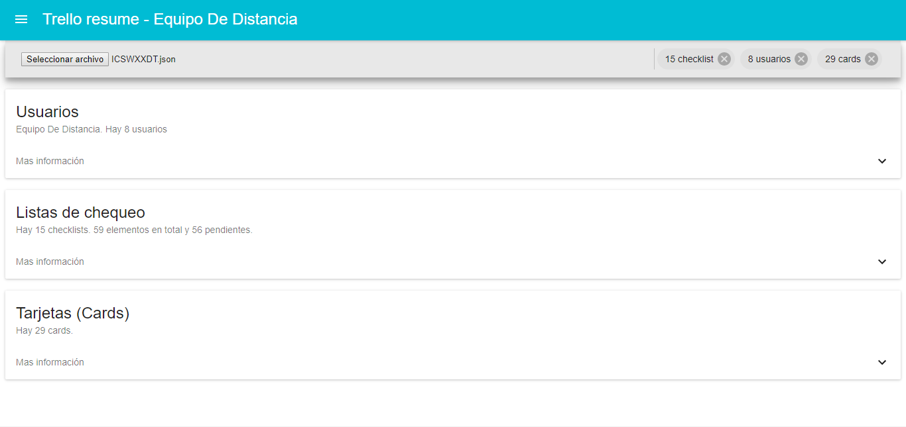

[](https://deploy.now.sh/?repo=https://github.com/zeit/next.js/tree/master/examples/with-material-ui)
# Trello Resume

Inline-style: 


## How to use

Download the repo

```bash
git clone https://github.com/juliandavidmr/TrelloResume.git
cd TrelloResume
```

Install it and run:

```bash
npm install
npm run dev
```

Deploy it to the cloud with [now](https://zeit.co/now) ([download](https://zeit.co/download))

```bash
now
```

## Trello
Enter your trello board, then enter the `Show menu` context menu and export your board in the `More > Export and print > Export to JSON` option, a file will be downloaded containing all the information on your board, this file is used by TrelloResume for Process the data.

Do not worry about security of information,
TrelloResume does not store anything as it works on the client side.

## The idea behind the example

This example features how you use 
[material-ui](https://github.com/callemall/material-ui)
(Material components that implement Google's Material Design) 
with Next.js. You can also see more details about obtaining 
the data in [Trello](https://trello.com)


### Any suggestions or help is welcome.
;)